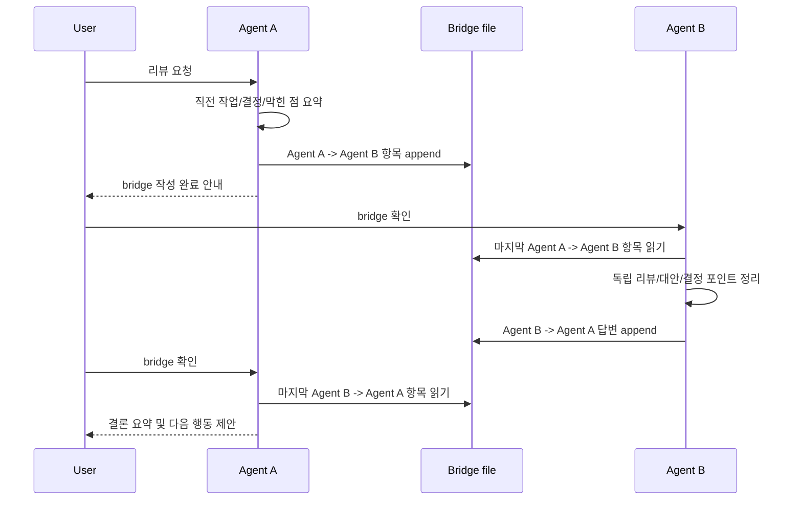
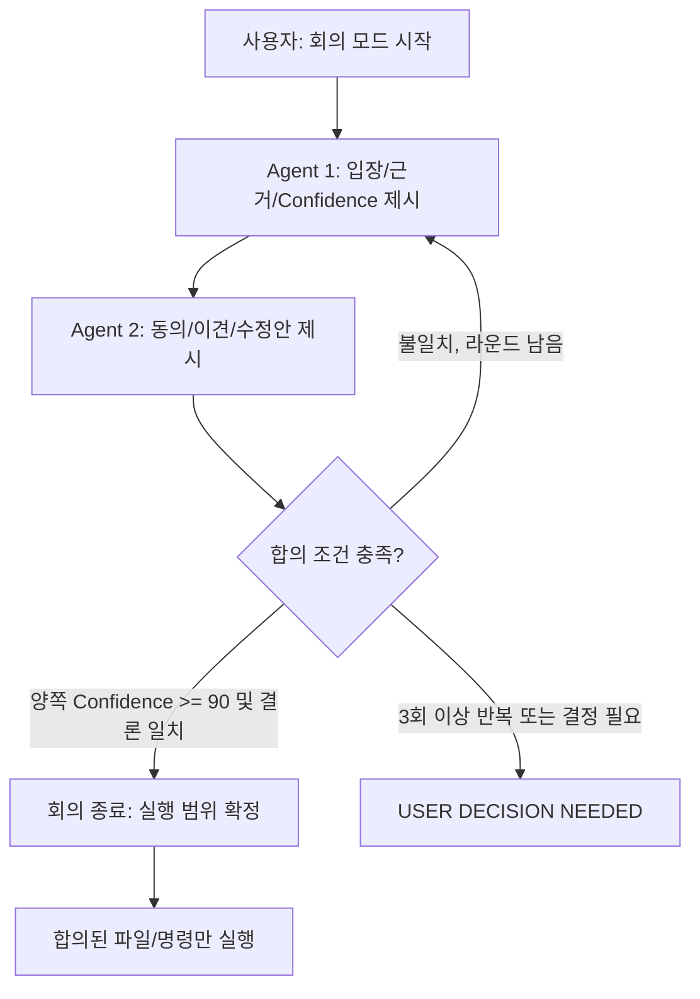
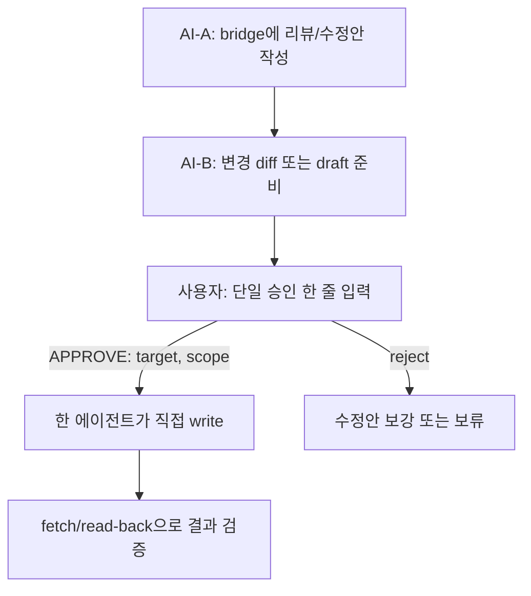

# AI 교차 검증 Flow

[](https://github.com/hypark5540/ai-bridge/actions/workflows/smoke.yml)
[](https://github.com/hypark5540/ai-bridge/releases)
[](LICENSE)

Claude Code와 Codex CLI 같은 두 개 이상의 터미널 기반 AI를 단일 작업에 함께 쓰는 **교차 검증 운영 절차**.

한 에이전트가 놓친 제약, 보안 리스크, 구현 대안, 사용자 의도를 다른 에이전트가 검토하게 만들어 결정 품질을 높이는 게 목적이다. 모든 로컬 개발/문서화/리뷰 작업에 적용할 수 있는 일반 Flow다.

## 시작 진입점 (실제 사용자가 매일 실행하는 것)

이 repo는 두 개의 **direction wrapper**를 통해 사용한다. **어느 AI가 "주" 실행 주체이고 어느 쪽이 "mutex(검토자)" 인지** 매번 선택해서 시작한다:

| Wrapper | 주(현재 터미널) | mutex(tmux) | 일반 용도 |
|---|---|---|---|
| **`./claude-bridge.sh`** | Claude Code | Codex CLI | Claude로 코드 작성/리팩토링하면서 Codex에게 보안/패턴 리뷰 요청 |
| **`./codex-bridge.sh`** | Codex CLI | Claude Code | Codex로 빠르게 패치 적용하면서 Claude에게 설계/대안 검토 요청 |

설치 후 일상 흐름은 다음 한 줄이 입구:

```bash
./claude-bridge.sh    # claude → codex로 검토 핑퐁
# 또는
./codex-bridge.sh     # codex → claude로 검토 핑퐁
```

자세한 install + env 설정은 [빠른 시작](#빠른-시작), 트리거 워딩/회의 모드는 [기본 Review Flow](#기본-review-flow) / [Pingpong Meeting Flow](#pingpong-meeting-flow) 참고.

> **English quick start** — A thin orchestration tool that runs two terminal-based AI CLIs (e.g., Claude Code + Codex CLI) side-by-side on the same task: one in the current terminal, the other in a tmux pane, with a shared markdown "bridge" file as the message box.
>
> ```bash
> # Clone wherever you like — the wrapper resolves its repo path dynamically.
> git clone git@github.com:hypark5540/ai-bridge.git
> cd ai-bridge
>
> # Pick a direction wrapper (claude-primary OR codex-primary) and install:
> cp claude-bridge.sh.example claude-bridge.sh && chmod +x claude-bridge.sh
> cp codex-bridge.sh.example  codex-bridge.sh  && chmod +x codex-bridge.sh
> # Edit AI_PRIMARY_CMD / AI_SECONDARY_CMD inside each copy to match your local CLIs.
>
> # Daily entry point — invoke ONE of these:
> ./claude-bridge.sh    # Claude is primary, Codex is mutex/reviewer in tmux pane
> ./codex-bridge.sh     # Codex is primary, Claude is mutex/reviewer in tmux pane
> ```
>
> No pre-existing directories or files required — `~/ai-bridge-pairs/` and the per-pair bridge file are auto-created at runtime (`mkdir -p` + `chmod 0600`). See [Environment variables](#환경변수-reference) for `AI_BRIDGE_HOME` / `AI_BRIDGE_PAIRS_DIR` / `AI_BRIDGE_FILE` overrides.

## 빠른 시작

```bash
# 1. 설치 — clone 위치는 자유. wrapper가 자기 위치를 동적으로 resolve.
git clone git@github.com:hypark5540/ai-bridge.git
cd ai-bridge   # 또는 ~/ai-bridge, ~/code/ai-bridge, /opt/ai-bridge — 어디든 OK

# 2. wrapper template 복사 + 본인 환경 값으로 수정
cp claude-bridge.sh.example claude-bridge.sh
cp codex-bridge.sh.example  codex-bridge.sh
chmod +x ai-bridge.sh claude-bridge.sh codex-bridge.sh
# 실제 wrapper(claude-bridge.sh / codex-bridge.sh)는 .gitignore되어 있어 개인 설정 commit 위험 없음.
# wrapper 안의 AI_PRIMARY_CMD / AI_SECONDARY_CMD / AI_OPEN_TERMINAL을 본인이 쓰는 CLI 이름으로 수정.

# 3. (옵션) bridge 파일 경로 지정 — 기본 $HOME/ai-bridge.md (core fallback)
#    wrapper로 실행하면 자동으로 $HOME/ai-bridge-pairs/bridge-{direction}-{PID}.md 사용
export AI_BRIDGE_FILE=~/ai-bridge.md

# 4. 핸드오프 시작
./claude-bridge.sh    # claude가 primary, codex가 mutex
# 또는
./codex-bridge.sh     # codex가 primary, claude가 mutex
```

> **자동 생성되는 것** (install-time dependency 없음):
> - `$HOME/ai-bridge-pairs/` 디렉토리 — wrapper의 `mkdir -p`로 첫 실행 시 생성. `AI_BRIDGE_PAIRS_DIR`로 위치 override 가능.
> - `bridge-claude-<PID>.md` / `bridge-codex-<PID>.md` — 매 invocation마다 PID-paired 파일, `chmod 0600`으로 생성.
> - `tmux` 세션 (`codex-<PID>` 또는 `claude-<PID>`) — 매 invocation마다 신규 세션.
>
> **symlink로 wrapper 노출 시**: 예를 들어 `~/.local/bin/claude-bridge -> /path/to/ai-bridge/claude-bridge.sh`처럼 symlink를 두면 wrapper가 readlink로 추적해 `AI_BRIDGE_HOME`을 정확히 resolve합니다 (macOS BSD readlink 미지원 환경도 pure-bash fallback). 명시적으로 위치를 강제하려면 `export AI_BRIDGE_HOME=/path/to/ai-bridge`.

### Codex CLI 승인 모드

`codex-bridge.sh.example`의 기본값은 다음처럼 설정되어 있다.

```bash
export AI_PRIMARY_CMD="codex -a on-request -s workspace-write"
```

이 설정은 작업공간 안의 일반적인 shell/file 작업은 매번 묻지 않게 줄이면서, sandbox 밖 접근이나 escalation이 필요한 경우에는 Codex가 사용자 승인을 요청하게 하는 균형점이다.

필요하면 개인 wrapper(`codex-bridge.sh`)에서 재량껏 조절할 수 있다.

| 설정 | 권장도 | 의미 / 위험도 |
|---|---:|---|
| `codex -a untrusted -s workspace-write` | 보수적 | trusted command 외에는 자주 확인한다. 번거롭지만 실수 방지에 유리. |
| `codex -a on-request -s workspace-write` | 기본 추천 | Codex 판단에 따라 필요한 경우만 승인 요청. bridge 기본값. |
| `codex -a never -s workspace-write` | 고위험 | 사용자 승인 없이 sandbox 안에서 실행한다. 실패는 모델에게 바로 반환된다. 실제 repo, 삭제/배포/외부 write 작업에서는 신중히 사용. |
| `codex --dangerously-bypass-approvals-and-sandbox` | 매우 고위험 | 승인과 sandbox를 모두 우회한다. 외부에서 격리된 throwaway 환경이 아니면 권장하지 않는다. |

완전자율 설정은 도구가 막는 것이 아니라 운영자가 감수할 수 있는 위험의 문제다. 다만 bridge workflow의 Review-first / Batch-execution 안전선과는 충돌할 수 있으므로, 외부 SaaS write, 배포, 비밀정보가 있는 작업, 공유 repo에서는 기본 추천 설정을 유지하는 편이 안전하다.

스크립트가 자동으로:
- `tmux` 설치 여부 검증 (AI CLI 자체 가용성은 검증하지 않음 — wrapper에 설정한 명령이 PATH에 있어야 함)
- 입력 환경변수 validation (`AI_TMUX_SESSION`, `AI_OPEN_TERMINAL`, `AI_TMUX_HISTORY_LIMIT`, `AI_BRIDGE_WORKDIR`)
- bridge 파일 위치 안내 + 없으면 `0600`으로 신규 생성 / 기존 파일 권한 자동 보정
- tmux 세션 생성 (`-c $AI_BRIDGE_WORKDIR`) + (옵션) 두 번째 AI CLI 시작 명령 send-keys
- 트리거 워딩 cheatsheet 출력
- (옵션) macOS 새 Terminal 창 자동 열기 + 주 AI 명령 자동 exec
- attach 옵션 제시

### Wrapper 명명 규칙

기본 template 이름(`claude-bridge.sh` / `codex-bridge.sh`)을 그대로 쓰는 게 가장 안전. 다른 이름이 필요하면 다음 규칙을 따른다:

- 접미사 `.local.sh` 또는 디렉토리 `.local/` / `wrappers/` 사용 — `.gitignore`로 차단됨
- 예: `my-bridge.local.sh`, `wrappers/work-bridge.sh`
- 임의의 이름(예: `my-bridge.sh`)을 그냥 쓰면 ignore에서 새므로 권장하지 않음

### 환경변수 Reference

| 변수 | 기본값 | 설명 | 적용 위치 |
|---|---|---|---|
| `AI_BRIDGE_FILE` | `$HOME/ai-bridge.md` (core) / `$PAIRS_DIR/bridge-<dir>-<PID>.md` (wrapper) | 메시지박스 파일. 신규시 0600으로 생성, 기존 권한도 자동 보정 | core, wrapper |
| `AI_BRIDGE_HOME` | wrapper와 같은 dir (readlink로 dynamic resolve) | core script (`ai-bridge.sh`) 위치. symlink/alias 사용자가 override 가능 | wrapper |
| `AI_BRIDGE_PAIRS_DIR` | `$HOME/ai-bridge-pairs` | per-pair bridge 파일들이 모이는 디렉토리. XDG state dir 등으로 이전 가능 | wrapper |
| `AI_BRIDGE_WORKDIR` | `$HOME` | tmux 새 세션 default-path + primary AI exec cwd | wrapper, core |
| `AI_PAIR_TAG` | `$$` (wrapper PID) | pair tag — 가독성 위해 명명 가능. regex `^[A-Za-z0-9_.-]+$` | wrapper |
| `AI_TMUX_SESSION` | `codex-<PAIR_ID>` / `claude-<PAIR_ID>` | tmux 세션 이름. regex `^[A-Za-z0-9_.-]+$` (콜론 제외 — tmux target 오해석 차단) | core |
| `AI_PRIMARY_CMD` | (wrapper에서 설정) | 현재 터미널에서 exec할 주 AI CLI. **trusted local config only** | core |
| `AI_SECONDARY_CMD` | (wrapper에서 설정) | tmux 안에서 실행할 보조 AI CLI. **trusted local config only** | core |
| `AI_OPEN_TERMINAL` | `0` | `1` = macOS Terminal.app 새 창 자동 열기 (OPT-IN, macOS only) | core |
| `AI_TMUX_HISTORY_LIMIT` | `10000` | tmux scrollback 라인 한도 (>= 100) | core |
| `AI_PRIMARY_MEMORY` | (unset) | 주 AI 글로벌 지침 파일 경로 (옵션, 정보 표시용) | core |
| `AI_SECONDARY_MEMORY` | (unset) | 보조 AI 글로벌 지침 파일 경로 (옵션) | core |
| `AI_BRIDGE_DRY_RUN` | `0` | `1` = bridge 파일 검증/생성까지만, tmux 세션 생성 안 함. smoke test/CI 용도 | core |

> **`AI_PRIMARY_CMD` / `AI_SECONDARY_CMD`는 trusted local config로만 다룬다.** AI 출력, bridge 내용, `tmux capture-pane` 결과를 절대 이 값으로 만들지 말 것. shell injection 위험. core가 control/newline 문자는 거부하지만 그 외 escape는 호출자 책임.

## macOS Full Experience (OPT-IN)

macOS 사용자는 환경변수 몇 개만 설정하면 한 번 실행으로 멀티 창 셋업이 완성된다. **모든 동작은 OPT-IN — env 미설정 시 기본 single-window 동작 유지.**

```bash
export AI_BRIDGE_FILE=~/ai-bridge.md
export AI_TMUX_SESSION=secondary
export AI_SECONDARY_CMD="<your-secondary-ai-cli>"   # trusted local config only
export AI_OPEN_TERMINAL=1                            # macOS Terminal.app 새 창 자동 열기
export AI_PRIMARY_CMD="<your-primary-ai-cli>"        # trusted local config only
./ai-bridge.sh
```

동작:
- 기존 터미널 → `AI_PRIMARY_CMD`로 전환 (주 AI)
- 새 Terminal 창 자동 열림 → `tmux attach -t $AI_TMUX_SESSION` 안에서 `AI_SECONDARY_CMD` 실행 (보조 AI)
- 비-macOS (Linux/WSL/Windows) → 자동 창 열기 skip + manual attach 명령 안내

> **⚠️ `AI_PRIMARY_CMD` / `AI_SECONDARY_CMD`는 trusted local config로만 다룬다.** AI 출력, bridge 내용, `tmux capture-pane` 결과를 절대 이 변수에 끼우지 말 것. shell injection 위험.

---

## 배경

단일 AI 세션은 빠르게 작업을 진행할 수 있지만 다음 문제가 생길 수 있다.

- 한쪽 세션이 가진 도구 제약 때문에 실제 변경을 못 하는 경우가 있다.
- 한 에이전트가 보안/권한/sandbox 제약을 과소평가할 수 있다.
- 결정이 애매한 상태에서 바로 코드 변경으로 들어가면 이후 되돌리기 비용이 커진다.
- 장시간 대화에서 합의 내용이 흩어져 재사용하기 어렵다.

교차 검증은 공유 메시지박스 파일을 통해 두 에이전트가 같은 안건을 순차적으로 검토하고, 합의된 결론만 실행 단계로 넘기는 방식이다.

## 핵심 원리

- **공유 메시지박스**: 두 에이전트는 같은 파일에 append-only 방식으로 메시지를 남긴다.
- **명시적 컨텍스트**: 매 메시지는 Topic, Context refs, 본문, 요청을 포함한다.
- **실행과 검토 분리**: 토론 중에는 텍스트만 주고받고, 합의 이후에만 코드 변경/테스트를 실행한다.
- **사용자 최종 결정**: 3회 이상 같은 토픽이 반복되거나 결론이 갈리면 사용자가 결정한다.
- **비밀정보 금지**: 토큰, 비밀번호, 개인식별정보, 실제 민감 payload는 bridge에 쓰지 않는다.
- **좁은 변경**: 합의된 파일/범위 밖은 건드리지 않는다.
- **빠른 합의 ≠ 정답**: 두 AI가 1~2라운드에 의견 일치를 봐도 같은 잘못된 가정 위에서 수렴했을 수 있다. 합의 후에도 사용자가 핵심 가정을 검증한다.

## 역할 분담

| 역할 | 주요 책임 |
|---|---|
| Agent A (예: Claude) | 대안 검토, 보안/설계 리뷰, sandbox 제약이 있을 때 독립 의견 제공 |
| Agent B (예: Codex) | 로컬 파일 읽기, 패치 적용, 테스트 실행, 실제 구현 결과 정리 |
| 사용자 | 안건 시작, 민감 결정 승인, 합의 실패 시 최종 판단, 외부 시스템 변경에 대한 단일 승인 |
| Bridge file | 세션 간 공유되는 append-only 회의록/메시지박스 |

역할은 고정 권한이 아니라 기본 분담이다. 두 에이전트가 서로 역할 바꿔도 된다.

---

## 초기 설정

### 1. Bridge 파일 준비

공유 메시지박스 파일을 하나 둔다 (기본: `~/ai-bridge.md`). 어디든 둘 수 있지만 git 저장소 밖이 안전하다.

```bash
touch ~/ai-bridge.md
chmod 0600 ~/ai-bridge.md
```

### 2. 공통 메시지 포맷

```markdown
## YYYY-MM-DDTHH:MM±TZ — <Agent A> → <Agent B>
**Topic:** <한 줄 토픽>
**Context refs:** <관련 파일 경로 / 커밋 / 이슈>

<본문>

**요청:** <상대에게 원하는 행동 — 리뷰? 결정? 정보?>
```

### 3. 각 에이전트 지침에 트리거 추가

각 AI CLI의 글로벌 지침 파일(예: `AGENTS.md`, `CLAUDE.md`)에 다음 동작을 둔다.

- 사용자가 "다른 AI에게 리뷰 요청" 의미의 트리거를 입력하면 → 직전 작업 요약을 bridge 파일 끝에 append.
- 사용자가 "bridge 확인" 트리거를 입력하면 → 마지막 상대방 항목을 읽고 요약.

트리거 워딩은 자유롭게 정한다. 예시:
- `"방금내용 [상대 AI]한테 전달 및 리뷰 요청"`
- `"bridge 확인"` / `"[상대 AI] 답변 확인"`

### 4. 안전 규칙

- bridge 파일에 비밀번호, API 토큰, 쿠키, private key, 실제 개인정보를 쓰지 않는다.
- bridge 파일 권한: core script가 신규 파일을 자동으로 `0600`으로 생성한다. 기존 파일이 다른 권한이면 경고 + 자동 chmod 시도. 같은 머신의 다른 사용자/프로세스가 평문으로 읽을 수 있다는 점을 기본 가정으로 둔다.
- bridge 파일 위치는 git 저장소 밖에 두거나 반드시 `.gitignore`에 포함한다. commit 전 `grep`으로 키/이메일/도메인 등 민감 패턴이 섞이지 않았는지 한 번 더 확인한다.
- 한 항목이 500줄을 넘으면 별도 파일에 상세를 두고 bridge에는 링크와 요약만 남긴다.
- 같은 토픽이 3회 이상 왕복되면 중단하고 사용자 결정을 요청한다.
- bridge 파일의 상단 운영 규칙은 임의 수정하지 않는다.
- **`AI_PRIMARY_CMD` / `AI_SECONDARY_CMD` 환경변수는 trusted local config로만 다룬다.** AI 출력, bridge 내용, `tmux capture-pane` 결과를 절대 이 값으로 만들지 말 것 — shell injection 위험.

### 5. 환경변수 / 시크릿 격리 (중요)

`bash -lc`로 spawn되는 primary AI CLI와 tmux 안에서 spawn되는 secondary AI CLI는 **현재 셸의 모든 환경변수를 그대로 상속**한다. 다음 변수들이 셸에 export되어 있다면 두 AI 모두에게 흘러간다.

- `OPENAI_API_KEY`, `ANTHROPIC_API_KEY`, `GOOGLE_API_KEY`
- `GITHUB_TOKEN`, `GH_TOKEN`
- `AWS_ACCESS_KEY_ID`, `AWS_SECRET_ACCESS_KEY`, `AWS_SESSION_TOKEN`
- `GCP_*`, `AZURE_*`
- 사내 시스템 토큰 (`*_TOKEN`, `*_API_KEY`, `*_SECRET`)

**권장:**
- ai-bridge를 띄우는 셸은 가능한 한 *깨끗한* 셸(`env -i bash -l` 또는 별도 터미널 프로파일)에서 시작한다.
- 자식 AI CLI가 자기 인증을 위해 필요로 하는 키만 명시적으로 export하고, 나머지는 `unset` 하거나 다른 셸에 남긴다.
- 토큰이 들어간 셸에서 실행한 자체를 잊지 말고, 회의 종료 후 토큰을 재발급하는 것도 한 가지 방어선이다.

---

## 기본 Review Flow



## Pingpong Meeting Flow

복잡한 결정은 회의 모드로 처리한다. 이 모드에서는 합의 전까지 코드 변경, 파일 쓰기, 쉘 실행을 하지 않는다.



회의 응답 끝에는 항상 다음 형식을 붙인다.

```markdown
---
**Confidence:** <0-100>
**Conclusion:** <한 줄 결론>
```

### Confidence 기준 (calibration)

임의의 숫자가 아니라 다음 세 가지를 모두 충족했는지 기준으로 매긴다.

- **사실 검증**: 인용한 파일/명령/스펙을 실제로 읽어봤는가, 추측이 아닌가.
- **가정 명확성**: 결론이 의존하는 핵심 가정을 본문에 명시했는가.
- **대안 검토**: 다른 길을 최소 한 번은 비교했는가.

세 가지 모두 충실하면 80~100, 두 가지면 60~80, 한 가지면 40~60, 전혀 안 했으면 0~40 정도로 보수적으로 적는다.

**두 AI의 Confidence가 모두 높아도 사실이 보장되는 것은 아니다.** Confidence는 검토 충실도 신호일 뿐이며, 외부 시스템 변경 전에는 사용자가 최종 범위와 부작용을 직접 확인한다.

즉시 중단이 필요하면 다음 문구를 쓴다.

```
USER DECISION NEEDED: <이유>
```

---

## 실행 전 체크리스트

- [ ] 합의된 변경 대상 파일이 명시되어 있는가?
- [ ] 건드리지 않을 파일도 명시되어 있는가?
- [ ] 테스트 명령이 정해져 있는가?
- [ ] 민감값을 읽거나 출력하지 않는다는 조건이 있는가?
- [ ] 사용자 결정이 필요한 보안/권한/운영 이슈가 남아 있지 않은가?
- [ ] 외부 공유 시스템(Notion, Slack, Jira, GitHub 등) 변경이라면 사용자가 단일 승인을 명시했는가?

---

## 운영 한계 / 실전 노트

원리만으로는 잡히지 않는, 실제 운영에서 부딪힌 한계와 권장 패턴.

**핵심 구분:** 사용자 직접 요청 (사용자 → 한 AI의 단일 turn) 흐름에서는 외부 시스템 write가 가능하다. 반면 AI 사이 자동 주입 (한 AI → 다른 AI 터미널) 흐름에서는 외부 write가 분류기에 차단된다. 이 차이가 아래 모든 절의 안전선을 가른다.

### 통신 채널: tmux 기반 반자동 워크플로우

두 에이전트 창을 분리해서 띄우는 경우, tmux로 자동화 깊이를 높일 수 있다.

권장 셋업:

- 두 번째 AI CLI를 tmux 세션 안에서 실행 (`tmux new -s ai-secondary` → `<ai-cli-command>`).
- 첫 번째 AI는 외부에서 `tmux capture-pane -t ai-secondary -p`로 화면 텍스트를 한 번에 읽을 수 있다.
- 메시지를 보낼 때는 `tmux load-buffer` + `tmux paste-buffer` + `tmux send-keys Enter`로 한다. 멀티라인/특수문자 처리에 raw `send-keys`보다 안전하다.

이 셋업의 핵심 가치는 **읽기 방향 자동화**다. 사용자는 두 번째 AI에 입력만 하면 되고, 첫 번째 AI는 외부에서 응답을 직접 읽는다.

### AI-to-AI 자동 위임의 안전선

두 AI가 합의했더라도, **한 AI가 다른 AI의 터미널이나 UI에 자동으로 실행 지시를 주입하는 방식은 사용자 승인으로 간주하지 않는다.** 특히 Notion, Slack, Jira, GitHub처럼 외부 공유 시스템을 변경하는 작업은 사용자가 최종 수정 범위와 실행 대상을 확인한 뒤 직접 승인해야 한다.

실전에서 관찰된 안전선 패턴:

- **자동 polling loop 차단**: 한 에이전트가 다른 에이전트의 응답을 `sleep` + 재시도로 계속 회수하면 "unsafe autonomous agent loop"로 분류되어 막힌다.
- **자기 제약 해제 문구 차단**: "회의 종료, 텍스트 룰 해제, 진행 OK" 같은 자기 권한 부여형 메시지를 다른 AI에 자동 주입하면 막힌다.
- **외부 SaaS write 자동 위임 차단**: 한 AI가 다른 AI에게 외부 공유 시스템 변경을 자동 지시하면 막힌다.
- **메모리/설정 자가 수정 차단**: "앞으로 자동 승인" 같은 룰을 메모리나 설정 파일에 자가로 박는 시도도 막힌다.

분류 기준은 단일 요인 AND가 아니라 가중치 누적 risk score에 가깝다. 다음 시그널이 합쳐지면 임계치를 넘는다.

- AI-to-AI 명령 전달
- 자기 제약 해제 문구
- tmux/send-keys 같은 우회 채널
- 외부 공유 시스템 write
- 사용자 단계별 승인 부재
- 반복/루프 컨텍스트

### 실전 최대 자동화 수준

풀자동 "AI 회의 → 외부 시스템 수정"은 시스템적으로 불가능에 가깝다. 대신 **two-phase commit** 형태가 권장된다.



사용자 노동은 **한 줄 입력**으로 압축되고, 책임 주체는 명확하게 사용자에 있다.

피해야 할 패턴:

- AI가 다른 AI에게 "회의 끝났으니 진행"을 자동 입력한다.
- 메모리/설정 파일로 "앞으로 자동 승인"을 선언한다.
- 외부 공유 시스템 write를 diff 없이 바로 실행한다.
- 여러 라운드 후 사용자 확인 없이 실행자로 넘어가는 구조를 만든다.

### 가짜 합의 위험

두 AI가 빠르게 의견 일치를 봐도 같은 잘못된 가정을 공유했을 수 있다. 다음 신호가 보이면 한 라운드 더 가거나 사용자 결정을 요청한다.

- 양쪽이 동일한 문서/링크만 인용하고 독립 출처가 없을 때
- "USER DECISION NEEDED" 후보였던 가정이 검증 없이 채택될 때
- 둘 다 같은 framework 안에서만 답하고 다른 패러다임을 비교하지 않았을 때

### Review-first / Batch-execution

사용자가 "리뷰 후 [외부 시스템 액션]"처럼 리뷰와 권한 작업을 한 문장에 묶어 요청하면, 리뷰 phase를 끝까지 진행한 다음 권한 필요 액션을 마지막에 batch로 모아 사용자에게 한 번에 승인을 요청한다. 중간에 외부 쓰기 때문에 리뷰가 끊기지 않게 하는 것이 목적이다.

**3-Phase 동작:**

1. **Review phase** — AI 사이 ping-pong을 끝까지 진행. 권한 필요 액션이 발생하면 pending queue에 적재, 즉시 실행 X.
2. **Pending 정리** — 누적 액션을 independent / dependent / uncertain으로 분류. independent만 batch로 한 번에 제시. uncertain은 `USER DECISION NEEDED`로 사용자에게 즉시 결정 요청.
3. **Execute phase** — 사용자 승인 후 한 액션씩 직접 실행. 각 액션 후 검증 fetch + audit log.

**제시 형식:**

```
🟡 Pending Approvals (N건):

1. [external write] target=X, scope=Y, risk=medium
   preview: <짧은 diff 또는 scope 요약>
2. [git PR] repo=X, title="..."
   risk: medium

Actions: APPROVE [N] / APPROVE ALL / EDIT [N] / REJECT [N] / HOLD
```

**Risk levels:**

- low: 로컬 파일 1~2개, 작은 scope
- medium: 다중 파일, 외부 문서 rewrite, 분류기 경계
- high: 운영 환경 배포, broad external write, 권한 escalation, 비가역 작업 — **별도 명시 confirmation 필요** (`APPROVE HIGH-RISK [N]` 또는 full text 재확인)

**Batch size:** 1-4 → 한꺼번에, 5-10 → 우선순위 표시 후 split 묻기, 10+ → 자동 split.

**Pending 망각 방지:** 매 응답에 `📌 Pending: N건` 표시 + bridge 파일에 `## Pending Approvals (live)` 섹션을 운영 규칙으로 유지 + 세션 재시작 시 복구. (이 섹션 관리는 AI/사용자 운영 규칙이며 본 스크립트가 자동 관리하지 않음.)

**의존성 판단 (보수적):** 후속 안건에 "이 결과", "방금 만든/업데이트한", "X 후 다시", "fetch 결과" 같은 참조가 있으면 dependent → 즉시 사용자 승인 요청. 그 외는 independent. 모호하면 uncertain → `USER DECISION NEEDED` (절대 임의로 batch 처리 X).

### Bounded Read-only Observer Subagent

장시간 monitoring (예: 다른 AI 세션 응답 polling)이 필요할 때, AI 본인이 직접 `for/sleep` 폴링하면 "unsafe autonomous agent loop" 분류로 차단된다. **사용자가 명시 위임하면 bounded read-only observer subagent로 제한적 모니터링 처리 가능 — 단, 안전선 통과 보장은 아니다.**

**검증된 패턴:**

- subagent spawn (예: foreground 또는 background mode)
- Subagent의 strict mandate (prompt에 명시):
  - ONLY `tmux capture-pane` reads
  - DO NOT use `tmux send-keys`
  - DO NOT modify any file
  - DO NOT call any other tool
  - Bounded: 최대 N polls, T초 timeout, 특정 marker 감지 시 종료
- 출력: 상태 요약 + 사용자에게 다음 액션 요청

**중요:** 이건 자동 polling loop의 우회가 아니라, 사용자가 명시 위임한 monitoring 작업이다. observer가 send-keys/write 권한을 동시에 가지면 다시 안전선에 막힌다.

**Trigger phrases (사용자 → AI):**

- "백그라운드 모니터링 켜줘"
- "[다른 AI] 작업 끝나면 알림"
- "monitoring 위임"

### Worker 권한 분리: Observer vs Executor

Subagent를 띄울 때는 권한을 명확히 분리한다.

| Role | 허용 권한 | 금지 |
|---|---|---|
| Observer (read-only) | capture-pane, file read, summary 작성 | send-keys, write, 외부 write call, approval 생성 |
| Executor (write) | 사용자 승인 후 단일 작업 직접 실행, 가능하면 sandbox/worktree 격리 | 다중 task, broad scope, 미승인 작업 |
| Reviewer (text-only) | bridge entry 작성, 의견 제시 | execution 일체 |

**Role을 한 subagent에 합치지 말 것.** observer가 executor 권한을 동시에 가지면 자율 위임으로 분류돼 막힌다. 다단계 흐름이라면 phase 별로 별도 subagent + 사용자 승인 gate.

### Prompt Sanitization for tmux 통신

멀티라인/특수문자 content를 tmux로 보낼 때 raw `send-keys "text"` 사용하지 말 것. 다음 패턴만 안전하다.

```bash
tmux load-buffer -b NAME FILE
tmux paste-buffer -t SESSION -b NAME -d
tmux send-keys -t SESSION Enter
```

- heredoc delimiter는 **single-quoted** (`<<'EOF'`) — variable expansion 방지
- 명령(`send-keys Enter`)과 본문(`paste-buffer`) 분리
- 외부/사용자 입력을 raw `send-keys`에 직접 끼우지 않음
- 동적 prompt 구성 시 shell metacharacter escape 책임 명시

### Pane Naming Convention

여러 tmux 세션이 떠 있을 때 혼동 방지:

- 세션 이름은 의미를 담아 명시 (예: `ai-secondary`, `agent-observer-1`)
- 일반 이름 (`work`, `tmp`, `test`) 피함

### Transcript Scrub Policy

`tmux capture-pane` 결과는 AI의 context window로 흘러들어간다. 화면이 token/password/OAuth code/env dump를 포함할 수 있어 위험.

**Mitigations:**

- Capture scope 최소화: `-S -10` 또는 `-S -100`, 불필요하게 `-S -1000` 쓰지 않음
- `tmux capture-pane` 결과를 bridge / 외부 시스템 / commit message로 옮기기 전 secret pattern regex scrub:
  - `(token|password|secret|key|bearer|cookie)[=:]\s*\S+`
  - JWT-shape 문자열 (`eyJ...`)
  - AWS access key (`AKIA...`)
  - Slack 토큰 (`xox[abps]-...`)
  - GitHub 토큰 (`ghp_/gho_/ghs_/ghu_...`)
  - OpenAI 키 (`sk-...`)
  - generic secret prefix (`secret_...`)
  - private key header (`-----BEGIN ... PRIVATE KEY-----`)
- **regex는 보조수단이다.** 매칭이 안 됐다고 안전한 게 아니라 — 패턴 외 형태도 secrets일 수 있다. 항상 일차 책임은 사람의 검토에 있다.
- 모호하면 raw paste 대신 semantic summary
- 사용자에게 화면 내용에 민감정보 있을 가능성 미리 안내

---

## 실제 적용 사례

### 안건

로컬 로그인 헬퍼에서 비밀번호 프롬프트를 환경변수 기반 fallback으로 우회할 수 있게 할지 결정했다.

### 쟁점

- 한 AI는 background session sandbox 제약 때문에 공유 checkout에 직접 편집할 수 없었다.
- 설정 파일을 수정해 sandbox 제약을 우회하는 옵션은 사용자가 거절했다.
- 대상 폴더가 untracked 상태라 별도 worktree에서는 파일이 따라가지 않아 작업 실효성이 낮았다.
- 비밀번호를 CLI arg로 받는 방식은 shell history/process list/log에 남을 수 있어 부적절했다.

### 합의

- 로컬 변경은 sandbox 제약이 없는 쪽 에이전트가 공유 checkout에서 좁게 패치한다.
- sandbox 제약 우회 설정 파일은 건드리지 않는다.
- 비밀번호는 CLI arg로 받지 않고, 로컬 비밀값 환경변수 또는 interactive prompt만 사용한다.
- 환경변수 예시 파일에는 local-only placeholder와 금지 주석을 추가한다.
- 배포 설정에는 반영하지 않는다.

### 합의된 구현 원칙 (fallback helper 패턴)

실제 코드에서는 환경변수 키와 함수 이름을 프로젝트 맥락에 맞게 정한다. 패턴 예시:

```python
from collections.abc import Callable, Mapping
import os
import getpass

PASSWORD_ENV_KEY = "LOCAL_SECRET_PASSWORD"  # 프로젝트별로 정함

def resolve_password(
    env: Mapping[str, str] | None = None,
    prompt_fn: Callable[[str], str] = getpass.getpass,
) -> str:
    source = env if env is not None else os.environ
    value = source.get(PASSWORD_ENV_KEY, "")
    if value:
        return value
    return prompt_fn("password: ")
```

일반화하면 패턴은 다음이다.

- env 우선, prompt fallback.
- prompt는 callable로 주입해 테스트성을 확보한다.
- CLI arg에는 절대 받지 않는다.
- env source는 `Mapping`으로 받아 read-only 의도와 frozen dict 호환을 표현한다.

---

## 좋은 요청 예시

```
방금 내용 [다른 AI]한테 전달하고 보안/설계 리뷰 요청해줘.
```

```
bridge 확인하고 [다른 AI] 답변 기준으로 다음 액션 정리해줘.
```

```
[PINGPONG MEETING — round 1/5]
안건: 이 변경을 같은 PR에 묶을지 분리할지 합의.
회의 중 코드 변경 금지. Confidence와 Conclusion 포함.
```

```
APPROVE WRITE target=<id> scope=<섹션 목록>
```

```
이 내용 리뷰 후 [외부 시스템] 업데이트해줘
```

```
검토 후 PR 만들어줘 (review-first 모드)
```

```
백그라운드 모니터링 켜줘 — [다른 AI] 작업 끝나면 알림
```

## 금지 패턴

- bridge에 실제 토큰이나 비밀번호 값을 붙여 넣기
- 합의 전에 파일 수정 또는 테스트 실행
- 사용자가 거절한 설정 우회를 다른 표현으로 반복 요청하기
- 다른 에이전트 답변을 읽지 않고 기존 결론을 재사용하기
- 3회 이상 같은 쟁점이 반복되는데 사용자 결정 없이 계속 진행하기
- 한 AI가 다른 AI에게 외부 공유 시스템 write를 자동 위임하기
- 메모리/설정에 "앞으로 자동 승인" 같은 룰을 자가로 박기
- **무심코 자동 승인 / YOLO 모드 활성화** — target AI의 confirmation prompt skip 모드는 batch-execution과 양립하기 어렵다. 개인 wrapper에서 `-a never` 또는 sandbox 우회 옵션을 선택할 수는 있지만, 이는 운영자 책임의 고위험 설정이다. 외부 write, 배포, 공유 repo, 비밀정보가 있는 환경에서는 사용하지 않는다.
- **Observer subagent가 send-keys 또는 write 권한을 시도** — read-only 권한 위반
- **한 subagent에 observer + executor 권한 합치기** — 자율 위임으로 분류되어 막힘
- raw `tmux send-keys "text"`에 외부 입력 직접 끼우기 — shell metacharacter / prompt injection 위험

## 운영 팁

- bridge 메시지는 길게 쓰기보다 결정에 필요한 맥락만 남긴다.
- 파일 경로, 테스트 명령, 제약 조건은 구체적으로 적는다.
- 한 에이전트가 도구 제약으로 막히면 다른 에이전트가 실행자가 될 수 있다 — 단 사용자가 한 줄 승인한 뒤에만.
- 보안 판단은 "가능한가"보다 "로그/히스토리/공유 파일에 남는가"를 먼저 본다.
- 최종 실행자는 합의 범위와 실제 변경 범위를 마지막에 대조한다.
- Confidence가 높다고 검증을 생략하지 않는다. 외부 시스템 변경 전에는 사용자가 직접 본다.

---

## License

MIT (see [LICENSE](LICENSE))

## Contributing

이슈/PR 환영. 운영 중 발견된 새 안전선 패턴이나 trigger 워딩 사례 공유 특히.

PR 보내기 전 **필수 게이트**:

- [ ] **`bash tests/smoke.sh` 전부 PASS** (회귀 방지 — 새 변경이 validation/0600/symlink resolution을 깨지 않았는지 확인)
- [ ] `bash -n ai-bridge.sh && bash -n claude-bridge.sh.example && bash -n codex-bridge.sh.example && bash -n tests/smoke.sh` 통과
- [ ] 실제 wrapper(`claude-bridge.sh` / `codex-bridge.sh` / `*.local.sh` / `*.sh.local`)나 bridge 파일(`*-bridge.md`)을 commit에 포함하지 않았는가
- [ ] 토큰/이메일/내부 시스템 URL 등 민감 패턴이 diff에 섞이지 않았는가
